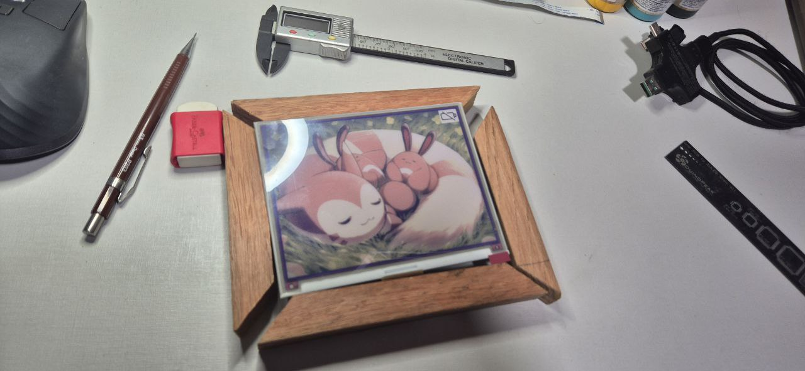

# Portrait: The 🖼️ ESP32 E-Ink Digital Photo Frame

This project implements an **ultra-low power digital photo frame** based on an e-ink display and ESP32, powered by a Li-ion battery and remotely controlled via Firebase.




---

## 📦 Components Used

- **E-Ink Display:** [Waveshare AC057TC1 (600x448)](https://alcom.be/uploads/Eink_AC057TC1_Specs-sheet.pdf)
- **Controller:** [ESP32 E-Paper Driver Board (Waveshare)](https://www.waveshare.com/wiki/E-Paper_ESP32_Driver_Board)
- **Battery:** Li-ion 3.7V 1800mAh
- **Battery Charger:** TP4056
- **Connectivity:** Wi-Fi + NTP time synchronization
- **Backend:** Firebase Realtime Database + Firebase Storage

---

## 🧠 Features

- 🔋 **Ultra-low power consumption** with deep sleep and battery level display on screen.
- 🖼️ **Remote image management** using Firebase's web interface (upload and remove).
- 🌟 A file named `especial.jpg` has **display priority** and is shown immediately.
- 🕛 **Automatic daily update at midnight**, or manually via button press.
- 📶 **Simplified Wi-Fi setup via QR Code**.
- ☁️ Firebase integration for synchronized and authenticated communication via token.

---

## Configuration 

### 🔧 Configuring data.h

Before compiling and uploading the firmware to your ESP32 e-ink display, you must configure the data.h file with your specific project details. This file holds all the necessary credentials and URLs for Firebase and Wi-Fi.

Here’s a breakdown of each field you must set:

### 📦 Firebase Setup

To use this project, you must first set up a Firebase project with the following:

- **Firebase Realtime Database**  
  (for tracking image display history and battery status)

- **Firebase Storage**  
  (to store images like `especial.jpg`, `photo1.jpg`, etc.)

- **Cloud Functions**  
  (to handle image listing, selection, and delivery)

Follow the official Firebase guide here:  
👉 [Get Started with Firebase Functions](https://firebase.google.com/docs/functions/get-started)

IMPORTANT: Choose us-central1 server!

After deployment, copy the generated **Cloud Functions URL** and use it as your `baseUrl` in `data.h`.

Also, set a **secret bearer token** to be used **both** in the `data.h` file and in your Firebase Functions for authentication.

> **Note:** The bearer token can be any string you choose, as long as both the ESP32 firmware and Firebase backend use the same token.


### frame/src/data.h

### 🛠️ How to Configure `data.h`

The `data.h` file contains configuration details specific to your device and Firebase project. Before compiling and uploading the firmware to your ESP32, you need to edit this file with the correct values.

Here is a breakdown of each field you need to fill:

```cpp
// Define the special image name (used for priority display)
#define ESPECIAL "especial.jpg"

// Unique identifier for your device (used in Firebase)
const char* id = "your_device_id";

// Wi-Fi credentials used to connect to the internet
const char* ssid = "your_wifi_ssid";
const char* password = "your_wifi_password";

// Local mDNS hostname for easier access (optional)
const char* customDomain = "portaretrato.local";

// Your Firebase Functions base URL (from your deployed backend)
String baseUrl = "https://your-region-your-project.cloudfunctions.net";

// These are derived automatically from baseUrl
String listUrl = baseUrl + "/getImages";
String getUrlBase = baseUrl + "/getImageUrl";
String deleteUrlBase = baseUrl + "/deleteImage";
String firebaseUrl = baseUrl + "/uploadStatus";

// The Bearer token used for simple authentication (must match your backend)
const char* token = "your_shared_secret_token";

// NTP server for getting the current time (used for scheduled image updates)
const char* ntpServer = "pool.ntp.org";
```

#### Example:

```cpp
const char* id = "frame01";
const char* ssid = "portrait";
const char* password = "supersecure123";
const char* customDomain = "portrait.local";
String baseUrl = "https://us-central1-myproject.cloudfunctions.net";
const char* token = "mysecretbearertoken";
```

⚠️ **Important**

- In your Cloud Functions project, inside the file `firebase/index.js`, set the `AUTH_TOKEN` constant to the **same Bearer token** defined in the `token` field of your `data.h` file in the ESP32 firmware.

- The Cloud Functions validate this token to ensure that only authorized devices can access resources.

- This setup offers a secure and centralized access control model.

- **Never expose your Bearer token** in clients or public repositories.

## How to Get Your Firebase Configurations for `index.html`

To connect your web app (like the `index.html` interface) to your Firebase project, you need to obtain the Firebase configuration object (`firebaseConfig`). This object contains all the necessary keys and identifiers to initialize Firebase in your web app.

### Steps to Obtain `firebaseConfig`:

1. **Go to the Firebase Console:**  
   Open [https://console.firebase.google.com/](https://console.firebase.google.com/) and select your Firebase project.

2. **Access Project Settings:**  
   Click the gear icon ⚙️ next to **Project Overview** in the left sidebar, then select **Project settings**.

3. **Register your Web App (if not done yet):**  
   - Scroll down to the **Your apps** section.  
   - Click on the **</>** icon to add a web app if you don’t already have one.  
   - Enter an app nickname (optional) and register the app.

4. **Copy the Firebase SDK snippet:**  
   After registering, Firebase will show you a JavaScript configuration snippet like this:

   ```js
   const firebaseConfig = {
     apiKey: "AIzaSyA...your-api-key...",
     authDomain: "your-project.firebaseapp.com",
     projectId: "your-project-id",
     storageBucket: "your-project.appspot.com",
     messagingSenderId: "1234567890",
     appId: "1:1234567890:web:abcdefg12345",
     measurementId: "G-XXXXXXX"
   };

### How to Add Your Firebase Config to `index.html`

After you get your Firebase configuration object (`firebaseConfig`) from the Firebase Console, follow these steps to add it to your `index.html` file:

1. **Open your `index.html` file** in a text editor.

2. **Locate the `<script>` section** where the Firebase SDK is initialized. It usually looks like this:

   ```html
   <script>
     // Your web app's Firebase configuration
     const firebaseConfig = {
       apiKey: "YOUR_API_KEY",
       authDomain: "YOUR_AUTH_DOMAIN",
       projectId: "YOUR_PROJECT_ID",
       storageBucket: "YOUR_STORAGE_BUCKET",
       messagingSenderId: "YOUR_MESSAGING_SENDER_ID",
       appId: "YOUR_APP_ID",
       measurementId: "YOUR_MEASUREMENT_ID"
     };
     // Initialize Firebase
     firebase.initializeApp(firebaseConfig);
   </script>

### 👤 How to Add a User with Email and Password in Firebase for login in interface

#### ✅ Step 1: Open Firebase Console

1. Go to: [https://console.firebase.google.com](https://console.firebase.google.com)  
2. Select your existing project or create a new one.

---

#### 🔐 Step 2: Enable Email/Password Sign-in Method

1. In the left sidebar, click **Authentication**.  
2. Go to the **Sign-in method** tab.  
3. Click on **Email/Password**.  
4. Enable the option and click **Save**.

---

#### 👥 Step 3: Add a User Manually

1. Still under **Authentication**, go to the **Users** tab.  
2. Click the **“Add user”** button.  
3. Fill in:
   - **Email**
   - **Password**
4. Click **Add user**.

---