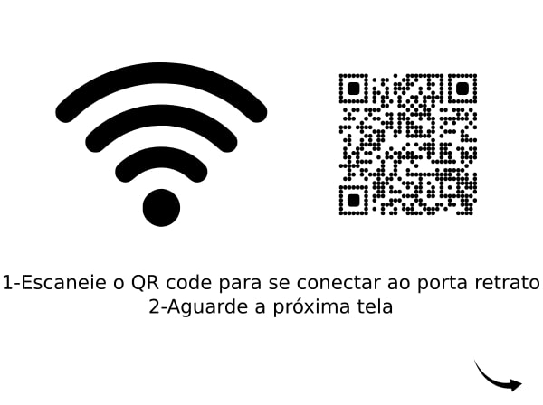
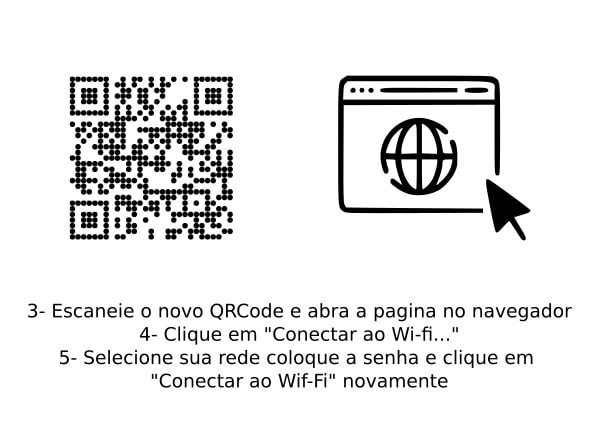

# 🖼️ Porta-Retrato Digital Wi-Fi com Tela eInk

Este projeto transforma uma tela eInk em um **porta-retrato digital de baixo consumo**, conectado via Wi-Fi, que carrega imagens da nuvem usando o Firebase.

---

## 🔧 Primeira Configuração — Como Conectar

Siga estes passos simples para colocar seu porta-retrato em funcionamento:

---

### 1. Escaneie o Primeiro QR Code para Conectar ao Wi-Fi

Ao ligar o porta-retrato pela primeira vez (ou após um reset), ele exibirá um **QR Code** na tela.

📱 **Escaneie o QR Code com seu celular**. Isso vai sugerir uma conexão com a rede Wi-Fi chamada **porta-retrato**:

> ⚠️ Alguns celulares podem pedir autorização para se conectar a redes sem internet. Se aparecer alguma mensagem, toque em **"Conectar apenas desta vez"** ou algo semelhante.

---

### 2. Acesse a Página de Configuração de Rede

Após conectar seu celular à rede do porta-retrato, ele **automaticamente exibirá um novo QR Code**.

📷 Escaneie esse novo código — ele abrirá uma **página local de configuração de Wi-Fi** hospedada pelo próprio dispositivo.

🌐 Nessa página, escolha sua rede Wi-Fi doméstica e digite a senha.

> 💡 Certifique-se de que sua rede tenha acesso à internet para que o porta-retrato consiga se comunicar com o Firebase.

---

### 3. Pronto para Exibir!

Se tudo foi configurado corretamente, em até **30 segundos**, o porta-retrato se conectará ao Wi-Fi e buscará a **imagem mais recente** salva no Firebase Storage.

✅ A imagem será exibida automaticamente na tela.

---

## 🚀 O que acontece depois?

- Você pode **enviar novas imagens remotamente** pela interface web do Firebase.
- Uma imagem com o nome `especial.jpg` será sempre exibida **primeiro**, se estiver presente.
- O porta-retrato atualiza automaticamente a imagem exibida **todo dia à meia-noite**, ou **ao pressionar o botão físico**.
- Há um **indicador de status da bateria** na tela, e o dispositivo é otimizado para **consumo ultra baixo de energia**.
